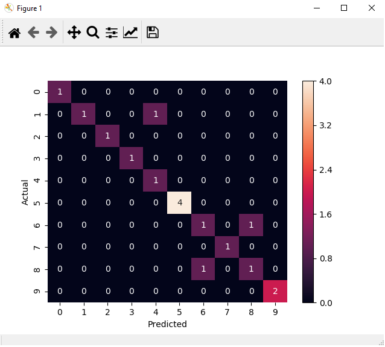

# Artificial intelligence Homework Backpropagation
## Páll Dávid és Böjthe Róbert Zoltán

### Használt módszer: Multi Layer Perceptron Backpropagation

### Használt könyvtárak:
 - Pandas
 - Matplotlib
 - Scikit-learn
 - Seaborn
 - Numpy
 

### Konfúziós mátrix:

